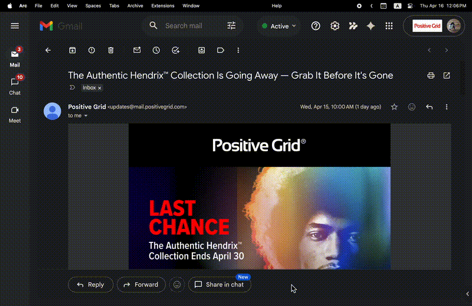

# Claude Code Forwarder

Forward Gmail and Slack threads to Claude Code with a keyboard shortcut. Claude Code processes the content autonomously — researching, drafting replies, and saving drafts — while you monitor and interact through Claude Island.



## How It Works

```
Gmail / Slack (browser)
  → Cmd+Shift+F
  → Popup: add optional instruction → Enter to send
  → Local webhook receives content
  → Spawns Claude Code in tmux
  → Claude Island picks up the session
  → You approve / interact from Claude Island
  → Draft appears in Gmail / Slack
```

No terminal switching. No copy-pasting. One shortcut to delegate.

## Requirements

- **macOS** (launchd + Claude Island are macOS only)
- **Claude Code CLI** — [install guide](https://docs.anthropic.com/en/docs/claude-code)
- **Chrome, Arc, or Chromium-based browser**
- **Slack in browser** (app.slack.com) — the standalone Slack desktop app won't work since Chrome extensions can't inject into it. Use Slack in your browser instead.

The setup script installs everything else automatically (tmux, Claude Island, Flask, webhook service).

## Setup

### Step 1: Run the installer

```bash
git clone https://github.com/dans-huang-pg/claude-code-forwarder.git
cd claude-code-forwarder
./setup.sh
```

This automatically installs tmux, Claude Island, Flask, and starts the webhook as a background service that auto-launches on login.

### Step 2: Load the Chrome extension

1. Go to `chrome://extensions`
2. Enable **Developer mode** (top-right toggle)
3. Click **Load unpacked**
4. Select the `extension/` folder from this repo

### Step 3: Set the keyboard shortcut to Global

This step is required — the shortcut won't work without it.

1. Go to `chrome://extensions/shortcuts`
2. Find **Claude Code Forwarder**
3. Click the pencil icon and press **Cmd+Shift+F** (or your preferred shortcut)
4. Change the dropdown from "In Chrome" to **Global**

That's it. Open Gmail or Slack and press **Cmd+Shift+F** to try it out.

## Usage

| Action | What happens |
|--------|-------------|
| **Cmd+Shift+F** in an email thread | Extracts full email thread |
| **Cmd+Shift+F** in a Slack thread | Extracts thread messages |
| **Hover** a Slack message + **Cmd+Shift+F** | Grabs that thread without opening it |
| **Hover** a Gmail inbox row + **Cmd+Shift+F** | Grabs that email without opening it |
| **Select text** + **Cmd+Shift+F** | Sends only the selected text |

A popup appears where you can add an optional instruction (e.g., "draft a reply", "summarize", "research this").

| Key | Action |
|-----|--------|
| **Enter** | Send to Claude Code |
| **Shift+Enter** | New line |
| **Esc** | Cancel |

The session appears in Claude Island. Claude Code runs with full access to your tools and skills.

## Recommended: Slack & Gmail Integration

For Claude Code to complete the full workflow (read threads, draft and send replies), configure MCP integrations:

- **Slack** — [Claude AI Slack MCP](https://docs.anthropic.com/en/docs/claude-code/mcp) or Slack API tokens
- **Gmail** — [Claude AI Gmail MCP](https://docs.anthropic.com/en/docs/claude-code/mcp) or Gmail API with OAuth

Without these, Claude Code can still read the forwarded content and give you advice, but won't be able to draft replies directly in Slack/Gmail.

## Architecture

```
┌─────────────────────┐
│   Chrome Extension   │
│  (Manifest V3)       │
│                      │
│  Content Scripts:    │
│  • gmail-content.js  │
│  • slack-content.js  │
│                      │
│  Cmd+Shift+F →       │
│  Extract DOM →       │
│  Show popup →        │
│  POST to webhook     │
└──────────┬──────────┘
           │ localhost:5581
┌──────────▼──────────┐
│   Flask Webhook      │
│                      │
│  POST /forward →     │
│  Build prompt →      │
│  tmux new-session →  │
│  claude "prompt"     │
└──────────┬──────────┘
           │ tmux session
┌──────────▼──────────┐
│   Claude Code CLI    │
│                      │
│  Full workspace:     │
│  • CLAUDE.md         │
│  • Skills            │
│  • MCP tools         │
│  • Draft-first flow  │
└──────────┬──────────┘
           │ hooks / socket
┌──────────▼──────────┐
│   Claude Island      │
│                      │
│  • See session       │
│  • Send messages     │
│  • Approve actions   │
└─────────────────────┘
```

## Configuration

**Webhook port:** Default `5581`. Change with `PORT` env variable.

**Keyboard shortcut:** Default `Cmd+Shift+F` (Mac) / `Ctrl+Shift+F` (other). Change in `chrome://extensions/shortcuts`. Must be set to **Global** scope.

**Webhook service:**
```bash
# Stop
launchctl unload ~/Library/LaunchAgents/com.claude-code-forwarder.webhook.plist

# Start
launchctl load ~/Library/LaunchAgents/com.claude-code-forwarder.webhook.plist

# Logs
tail -f /tmp/claude-forwarder-webhook.log
```

## Uninstall

```bash
# Stop and remove webhook service
launchctl unload ~/Library/LaunchAgents/com.claude-code-forwarder.webhook.plist
rm ~/Library/LaunchAgents/com.claude-code-forwarder.webhook.plist

# Remove Claude Island
brew uninstall --cask claude-island

# Remove the repo
rm -rf ~/claude-code-forwarder  # or wherever you cloned it

# Remove the Chrome extension manually in chrome://extensions
```

## Troubleshooting

**Shortcut doesn't work**
Make sure the shortcut is set to **Global** in `chrome://extensions/shortcuts`. "In Chrome" / "In Arc" scope may not work reliably.

**Popup says "Connection failed"**
The webhook isn't running. Check `curl http://localhost:5581/status` or restart the service.

**Slack popup: can't type in the text field**
Reload the extension in `chrome://extensions`. The keyboard trap may need a fresh injection.

**Session doesn't appear in Claude Island**
Make sure Claude Island is running and tmux is installed (`tmux -V`).

**Gmail/Slack extraction returns 0 messages**
DOM selectors may be outdated. The extension falls back to URL-only mode, letting Claude Code fetch content via MCP tools. Open an issue if this happens consistently.

## License

MIT
